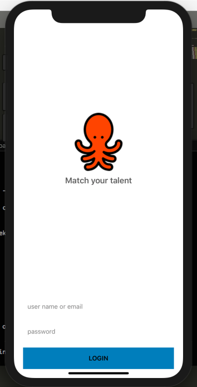
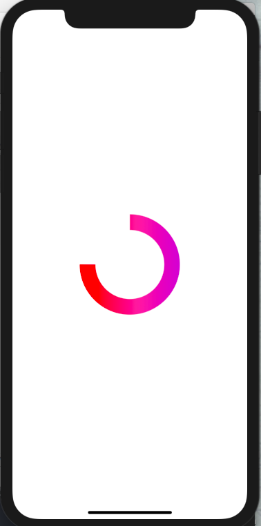
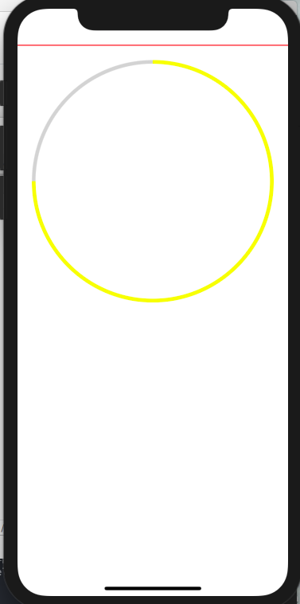
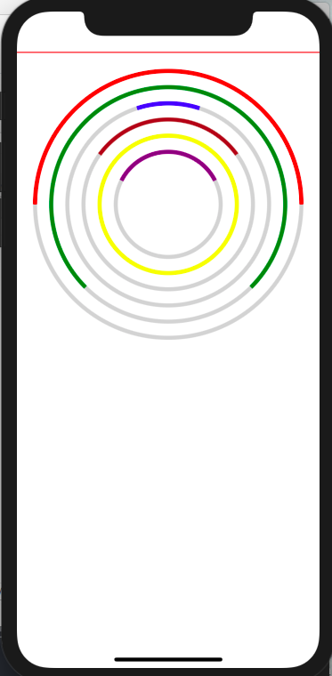

to learn react native and to experiment with it. 

### screens (rn-lab)

|Simple Login|Entry Screen|List View|
|--|--|--|
|||||

### screens (rn-lab-expo)
|Gradient Arc|Progress Arc|Multi Progress Arc|
|--|--|--|
|||||

for  view there is another example based on react-base (/list/cards-list-rb)
